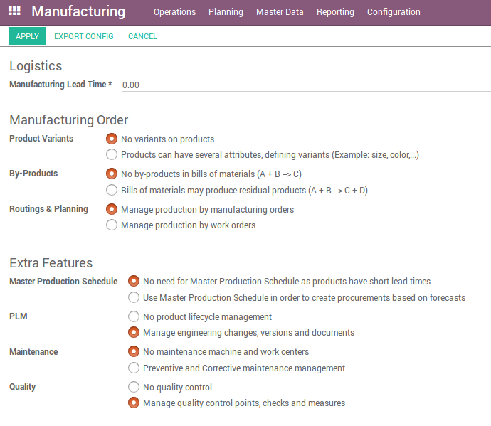
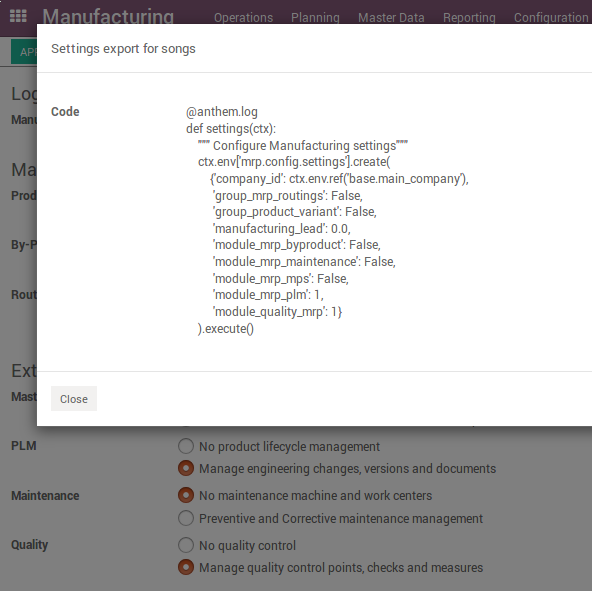

Odoo modules to use to create a prototype
=========================================

Here you will find Odoo modules we install on dev instance
to generate songs to replay a part of the Odoo setup.

Settings Exporter
-----------------

Adds a button `Export config` on all settings wizards:

Which launch a wizard to create a script usable in songs:

